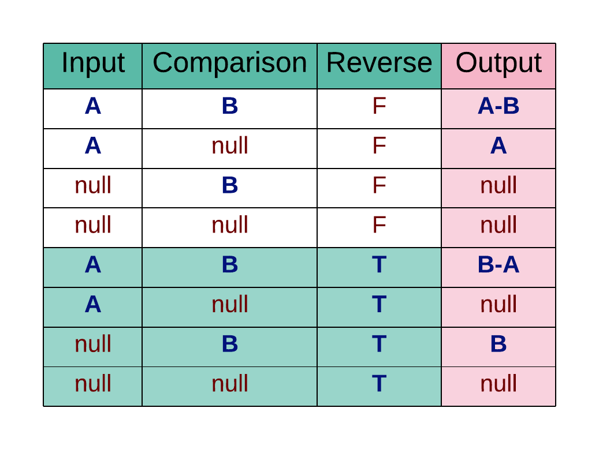

# s3parq
Parquet file management in S3 for hive-style partitioned data

## What is this? 
In many ways, parquet standards are still the wild west of data. Depending on your partitioning style, metadata store strategy etc. you can tackle the big data beast in a multitude of different ways. 
This is an AWS-specific solution intended to serve as an interface between python programs and any of the multitude of tools used to access this data. s3parq is an end-to-end solution for:
1. writing data from pandas dataframes to s3 as partitioned parquet.
2. reading data from s3 partitioned parquet *that was created by s3parq* to pandas dataframes.

*NOTE:* s3parq writes (and reads) metadata into the s3 objects that is used to filter records _before_ any file i/o; this makes selecting datasets faster, but also means you need to have written data with s3parq to read it with s3parq. The exception to this is un-partitioned parquets, which can now be fetched; the setting allowing this can be turned off however.

*TLDR - to read with s3parq, you need to have written with s3parq* 
 
## Basic Usage

We get data by dataset name. 
    
    import s3parq as parq

    bucket = 'mybucket'
    key = 'path-in-bucket/to/my/dataset'
    dataframe = pd.DataFrame(['some_big_data'])
    
    ## writing to s3
    parq.publish(  bucket=bucket,
                    key=key,
                    dataframe=dataframe, 
                    partitions= ['column1',
                                'column2'])

    ## reading from s3, getting only records with an id >= 150
    pandas_dataframe = parq.fetch(  bucket=bucket,
                                    key=key,
                                    filter= {"partition":'id',
                                    "values":150, 
                                    "comparison":'>='})
    

## Getting Existing Partition Values 
A lot of pre-filtering involves trimming down your dataset based on the values already in another data set. To make that easier, s3parq provides a few super helpful helper functions: 

    partition = 'order_id'

    ## max value for order_id column, correctly typed
    max_val = parq.get_max_partition_value(bucket,
                                 key,
                                 partition)
      
    ## partition values not in a list of order_ids. 
    ## if partition values are 1-6 would return [5,6] correctly typed.
    list_of_vals = [0,1,2,3,4]
    new_vals = parq.get_diff_partition_values(  bucket,
                                                key,
                                                partition,
                                                list_of_vals)

    ## list values not in partition value list
    ## if partition values are 3-8 would return [1,2] correctly typed.
    list_of_vals = [1,2,3,4]
    missing_vals = parq.get_diff_partition_values(  bucket,
                                                    key,
                                                    partition,
                                                    list_of_vals,
                                                    True)

    ## df of values in one dataset's partition and not another's
    ## this works by input -> where extra values would be, and comparison -> where they might not be
    ## similar to the get_diff_partition_values but handles it at the dataset level
    missing_data = parq.fetch_diff( input_bucket, 
                                    input_key, 
                                    comparison_bucket, 
                                    comparison_key, 
                                    partition)

    ## all values for a partition
    all_vals = parq.get_all_partition_values(   bucket,
                                                key,
                                                partition)

## Redshift Spectrum
Dataframes published to S3 can optionally be queried in AWS Redshift Spectrum. To enable this functionality, you must have an external database configured in Redshift. See the [AWS docs](https://docs.aws.amazon.com/redshift/latest/dg/c-using-spectrum.html) for help setting up a database in Redshift. To enable this functionality in S3parq, simply pass a dictionary of configurations to `publish()` via the redshift_params argument.

`redshift_params` is a dictionary which *must* contain the following keys: values (values are all strings unless noted otherwise):
- schema_name: name of the schema to add table_name to
- table_name: name of the table to create in Redshift
- iam_role: ARN link to an IAM Role with read/write Spectrum permissions
- region: AWS region (e.g. us-east-1)
- cluster_id: name of the cluster Redshift is configured on
- host: URL to the cluster specified in cluster_id
- port: port to connect to Redshift (usually 5439)
- db_name: name of the (existing) external database configured to use Redshift Spectrum
- ec2_user: user to use if running on EC2, otherwise send as a blank string

If redshift_params is present but invalid, the entire `publish()` fails.

*NOTE:* Spectrum schemas do _not_ work as normal database schemas. Tables are global to a Redshift Spectrum database, so each schema belonging to `db_name` can access all tables, regardless of the schema they are created with. Instead of schemas, different table registries require different Redshift Spectrum databases.

## Custom Publishes
By default, s3parq takes the provided Pandas dataframe and infers how to create the spectrum or redshift table schema based on the Pandas data types. However, s3parq provides the option to use a custom publish where the user can define the data types in the Spectrum or Redshift table. This capability gives the user full control over Redshift data types and also allows Redshift's decimal type to be used. To take advantage of Redshift's decimal type, decimal values must be stored in a Pandas object column as Python decimal objects. One caveat of using custom publish is that s3parq will not perform any data type conversion on your behalf. This means that pandas dataframes must be formatted in a way that is compatible with the given redshift data types when handed over to s3parq. 

To perform a custom publish, a dictionary must be created that contains the column definition for the Redshift or Spectrum table. The `custom_redshift_columns` dictionary simply contains the name of the pandas column and the column data type to use in the Spectrum or Redshift table. Any datatype supported by Redshift can be used. See following AWS documentation for a list of supported Redshift data types and aliases: [AWS doc](https://docs.aws.amazon.com/redshift/latest/dg/c_Supported_data_types.html) An example `custom_redshift_columns` dictionary is below.

custom_redshift_columns = {"colA":"VARCHAR(1000)", 
                        "colB":"BIGINT",
                        "colC":"REAL",
                        "colD":"DECIMAL(5,4)",
                        "colE":"VARCHAR",
                        "colF":"BOOLEAN"}

Use the `custom_publish` function with a `custom_redshift_columns` dictionary to take advantage of the custom publish feature.

## Gotchas
- Filters can only be applied to partitions; this is because we do not actually pull down any of the data until after the filtering has happened. This aligns with data best practices; the things you filter on regularly are the things you should partition on!

- Dataframe index is _not_ preserved!

- Metadata in AWS has a limit - we use a S3 object's Metadata attribute to store partition datatypes, hopefully you aren't trying to partition on so many columns that you hit it!

- When using `get_diff_partition_values` remembering which set you want can be confusing. You can refer to these diagrams: 

## Changelog

### 2.1.11
- Added support for Pandas Int32 and Int64 data types. 

### 2.1.9
- Added custom_publish function to publish_parq which allows spectrum and redshift tables to
use custom user defined redshift column definitions.
- Added create_custom_table to publish_redshift which creates custom redshift tables based on user defined redshift column definitions.
- Create_custom_table and publish_redshift enable support for Redshift's decimal data type. Decimals must be stored in a Pandas object column as Python decimal objects.
- Added unit tests for custom_publish and create_custom_table.

### 2.1.8
- Added functionality to fetch un-partitioned, non-s3parq parquet files

### 2.1.7
- setup.py no longer requires all of our requirements.txt for developers, 
but only crucial pieces with looser versioning

## Contribution
We welcome pull requests!
Some basic guidelines:
- *test yo' code.* code coverage is important! 
- *be respectful.* in pr comments, code comments etc;
